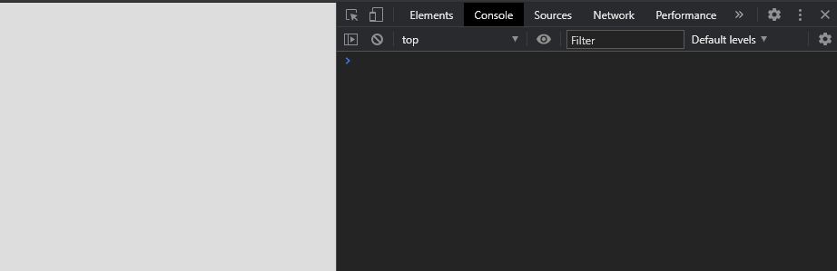
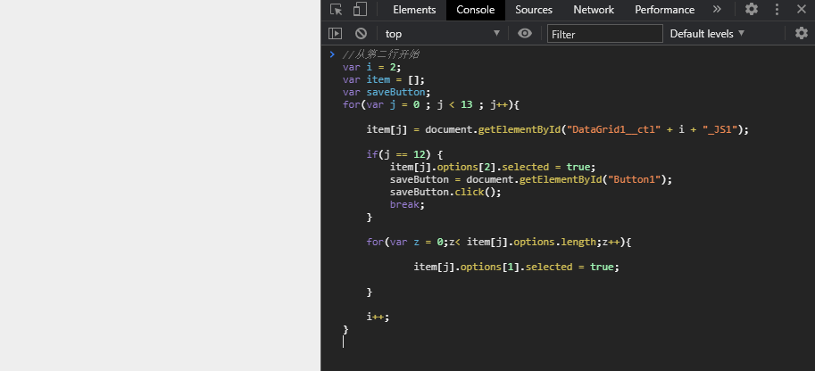
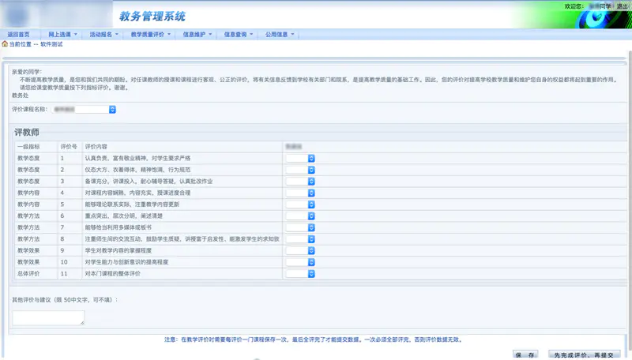

# 正方教务系统自动评教脚本（理论上通用）

正方教务系统的教学质量评价一键评教，理论上适用于任何使用正方教务管理系统的学校教务。

# 食用教程

## 手动版本
### 安装支持开发者工具/审查元素的浏览器

首先你得拥有一个可以支持打开开发者工具的浏览器。如 Chrome，360 极速浏览器， 新版Edge 等。

### 运行评教脚本

进入你学校的教务评教页面，按 F12 键或鼠标右击，选择检查/审查元素，会得到这样一个页面：

点击上方的 Console/控制台 ，将下方的第一个下拉栏选为 top。
复制 AutoEvaluate.js 中的内容，将其粘贴到下面的输入框中：

按下 Enter 键，即会自动开始评教。

## 傻瓜安装

### 先安装油猴
[图文详解油猴脚本安装方法 - Chrome插件网 (cnplugins.com)](https://www.cnplugins.com/zhuanti/266366.html)

### [将此脚本安装到油猴中](AutoEvaluate.user.js)

### 打开教师评教页面，即会自动开始评教

(图源网络)
